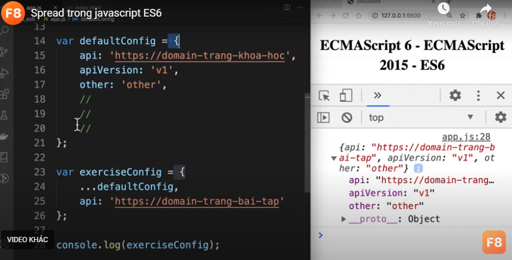
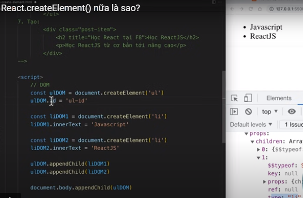
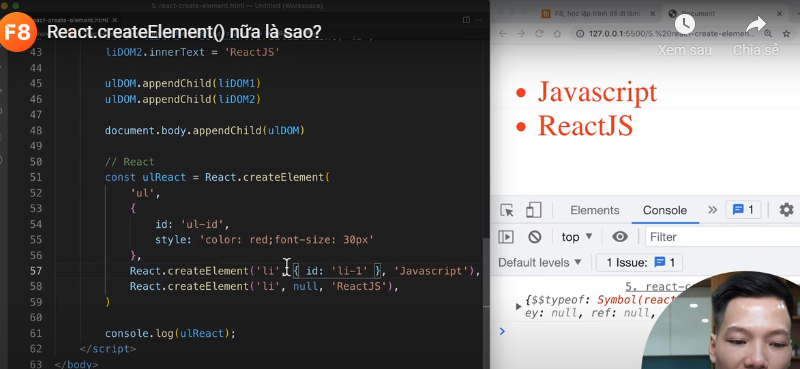
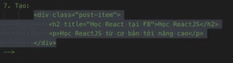
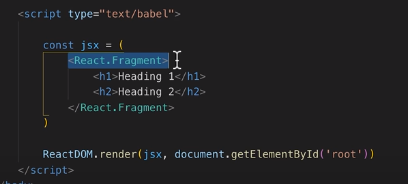
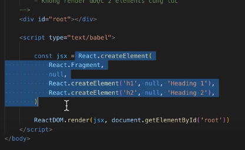
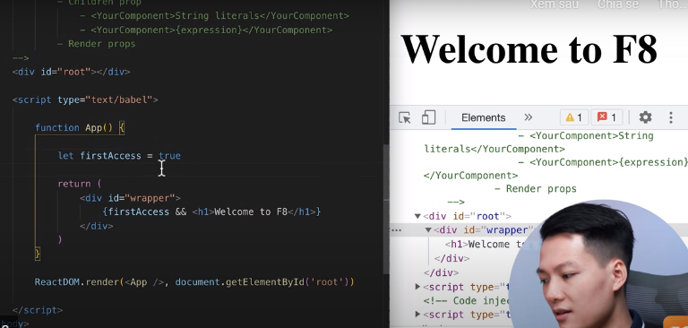
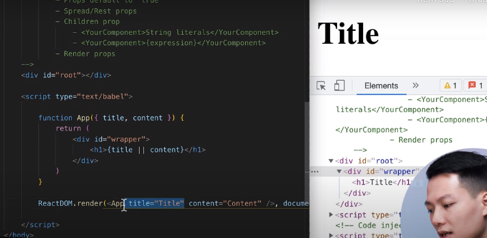

1. SPA & MPA
Không yêu cầu tải lại trang khi chuyển trang là 1 ưu điểm đặc trưng của SPA so với MPA.
2. Ôn ES6
    1. arrow function:
    const sum = (a,b)=>a+b;
    function khi viết dấu {} ni phía trong phải return 
    + khi function return ra object
    bt:
    const sum=(a,b)=>{ return {a:a,b:b}}
    viết gọn cost sum=(a,b)=>{a:a,b:b} viết ni bị lỗi sau => nếu {} pải return thêm () vào ->ok
    cost sum(a,b)=>({a:a,b:b})
    + khi chỉ có 1 tham số'
    viết gọn 
    const sum = a=>console.log a;
    + this trong function bình thường gọi là context của nó
    - context: định nghĩa văn bản
    - trong arrow function không có context this(note)
    + note : arrow function không dùng để viết contructor function
    2. Enhanced object literals
    + định nghĩa key : value cho object
     vd:<key và value trùng nhau{
        name:'JS'
     }>
     const name='JS'
     const value =12
     var course={
        name:name,
        value: value,
     }
     -> khi dùng Enhanced object literals viết gon
     var course={
        name,
        value
     }

    + định nghĩa method cho object
     var course={
        name,
        value,
        Getname: function(){
            return:name;
        }
     }
       -> khi dùng Enhanced object literals viết gon (ta bỏ lun chữ function)
       var course={
        name,
        value,
        Getname(){
            return:name;
        }
     }

    + định nghĩa key cho object dưới dạng biến
    var name:'nam'
    trong object{
        [name]:'trang'
    }
    + Hàm chuyển array thành object
    ```
        function arrToObj(arr) {
        const results= arr.reduce((acc,curr)=>{
        const obj={[curr[0]]:curr[1]}
        return {...acc,...obj}
        
        },{}
        )
        return results
        }
    ```
    3. destructuring
    <dùng cho object và array>
    + Ứng dụng lấy ra các phần tử của array
    vd:
    car array=['node','js','react']
    var[a,b,c]=array
    console.log(a,b,c)
    -> lấy ra dk node, js, react
    - khi lấy ra a &c -> var[a, ,c]=array;
    - khi lấy ra a & tất cả các phần tử còn lại của array
    var[a,...rest]=array;
    console.log(rest)->các ptu còn lại trừ a
    + Lấy các phần tử của object
     vd object={
        name:'trag',
        age:18
     }
    var {name,age} = object
    var {name,...rest} = object
    + Xoá đi 1 phần tử 
    var{name,...newObject}=object
    -> newObject là object mới đã xoá name
    + TRƯỜNG HỢP Object có Object con
    vd:
    ```
    vd object={
        name:'trag',
        age:18,
        newname(){
            name:'abc'
        }
     }
     ```
     var[name:parentname,newname:{name:chilren}]
     console.log(parentname)
     console.log(chilren})
     +name:parentname <cai ni là đổi tên không bị trùng>
    + Muốn nhận 1 giatri mặc định không có trong object
    vd: decription ni không có trong object
    var[name,decription="abc"]
    4. Rest parameters
    + ứng dụng lấy ra giá trị còn lại của array, object
    + ứng dụng như 1 thuộc tính của function
    - Khi toán tử rest là 1 tham số của function thì tham số đó là 1 array
    vd: function logger (...param){
        console.log(param)
    }
    logger(1,2,3,4,5)--> chính là array[1,2,3,4,5]
    tương tự như dùng đối tươg agruments
     vd: function logger (...param){
        console.log(agruments)
    }
    -> trả ra đối tượng agruments dạng array
    ++ bt
    ```
        const { 
        a = 'default', 
        b, 
        ...rest 
    } = {
        b: 'val1',
        c: 'val2',
        d: 'val3'
    };
    -> cái ni là destructuring á
    giống var{a,b,c}=object

    console.log(a, b, rest); // Output: ?

    ```
        kq:Do object không chứa key a nên a sẽ nhận giá trị mặc định là 'default'.

        Giá trị b bằng 'val1' do object có 1 key b có giá trị là 'val1'.

        Toán tử rest lấy ra tất cả các key còn lại chưa được lấy ra bằng destructuring. Lúc này, rest bằng object, chứa 2 key còn lại là c và d.
    5. Spread operator
    + ứng dụng nối mảng
    < spread - giải: bỏ đi dấu ngoặc nối 2 array lại với nhau>
    vd: const tr =[1,2,3]
        const vl =[4,5,6]
        consr arr=[...tr,...vl]( ... là spread bỏ dấu ngoặc [] còn 1,2,3)
    + ứng dụng hợp nhất object
    tương tự ...object : spread bỏ dấu {} ni và hợp nhất 2 object lại
    ++ trong object có 2 key trùng nhau sẽ lấy key được định nghĩa sau    
    + ứng dụng dùng spread hợp nhất trong api - config( cái ni dùng nhìu)
    => chỉ thay đổi api thâu còn lại thừa hưởng của cái object trên
    
    + ứng dụng spread trong tham số của function
    <rest dùng trong tham số truyền vào của function , còn spread dùng tham số ngoài của như trong console.log>
    6.JS modules
    import : đưa vào /<import logger from java.js>
    import { destructuring} là import từ export bình thường , còn trên là từ export defaut
    import * as constants from java.js => as tất cả các export bình thường không phải defaut vào 1 object là constants
    export: xuất ra (tại nơi viết hàm ) <export defaut ...>
    - 1 file chỉ <export defaut ...> 1 lần duy nhất
    + cách viết tắt
    - import logger from java.js
    - export defaut logger
    ===> viết gọn
    - import{defaut} from java.js

3. React , React DOM
   1. document.createElement==> tạo ra element 
   2. document.body.appendChild()==> lấy element của body xong thêm element con vào( phương thức appendChild để gắn 1 element vào một element khác.)
   vd: tương tự :
   <div id= 'root'><div>
   const root=documnent.getElementById('root')
   const h1= document.creatElement('h1')
   h1.innerText='HELLO EVERY'
   h1.id='heading'=> thêm id cho element
   h1.classNamr='heading1'
   h1.style.color='red'
   ==> thêm nhiều style
   h1.style='color: red; font-size:20px'
   Object.assign(h1.style,{
    color:'red',
    backgroundColor:'green'
   })
   note: trong key và biến của object không viết được dấu gạch ngang nối... viết kiểu ri backgroundColor
   root.appendChild('h1')
   3. console.dir()
   4. innerText, id, className, style
   < render element vào dom>
   5. note: react 17 đang học hiện có react 18 <2 ni có sự khác nhau>
   6. Cách thêm React vào website
   - github: nơi lưu trữ mã nguồn
   - NPMJS :lưu trữ sp được xây dựng từ mã nguồn==> nơi tải về dùng npm install react
   - UNBKG: Tác dụng lấy ra được những thư viện từ NPMJS dưới dạng cdn(content delivery netword): mạng lưới máy chủ có cơ chế đồng bộ lên tất cả máy chủ, khi người ta truy cập vô chi đó , sẽ tự động định tuyến đến máy chủ gần nhất -> để tải về nhanh nhất
   - cách lây được thư viện từ NPMJS theo cú pháp ni: 'unpkg.com/:package@:version/:file'
   https://unpkg.com/react@18.2.0/index.js
    ''use strict';

    if (process.env.NODE_ENV === 'production') {
    module.exports = require('./cjs/react.production.min.js');
    } else {
    module.exports = require('./ '); note : ./ cùng cấp với file index
    }'
   -  thay package bằng tên thư viện
   - 
   + vào đọc thư viện
   - https://unpkg.com/react@18.2.0/cjs/react.production.min.js');  
   7. Add react in websize
    <script src="https://unpkg.com/react@18/umd/react.development.js" crossorigin></script>
   8. official dos
   < đọc https://reactjs.org/docs/getting-started.html> phần docs hỉu về react

   9. React.createElement()->Trả về đối tượng React element( thah phần nhở nhất khi làm việc với thư  viện react)
   - So sánh với document.createElement()-> Trả về đối tượng DOM element(DOM nhỏ nhất là node)
   - Thay đổi id,className, style...
   +++  trên cách để render ra
   + tạo :
   <h1 title='hello' classNam='heading'>HELLO EVR<h1>
   + Tạo:
   <ul>
   <li>JS<li>
   <li>react<li>
   <ul>
   c1:

   
   c2:
   
   + ex:
    ```
        const h1React = React.createElement({
        'h1',
        {
            title: 'Học lập trình để đi làm'
        },
        'F8'
    });
    ```
    -->‘F8’ là children, mà children là 1 prop. Vậy nên ‘F8’ cũng là 1 prop của h1React
    + node : làm bài tập vd trên video f8
    
    10. React DOM
    ==> Để render react element ra dom-> trình duyệt
    -- React DOM là một thư viện được ví như cầu nối giữa React và DOM
    - react- native: ios,android ()
    ++ Dùng react dom render ra UI
    + khác nhau giữa reactdom version 17 & 18 chỗ render
    const containers =document.getElementById('root')
    const root =ReactDOM.createRoot((postitem)
    root.render(postitem)
    + note : import từ file react-dom/client 
4. JSX, Components,Props
    1. JSX:  javascript XML
    - đặc trưng XML là thẻ mở thẻ đóng.
    - html là cú pháp mở rộng của XML
    - JSX gần giống với html()nhưng k pải nha
    - Tạo React element với React.createElement() 
    - Nếu dùng cách này để code giao diện chắc chắn sẽ rất khó, chính vì vậy JSX ra đời giúp developer như chúng ta có cú pháp “ngọt ngào” hơn.
    - Ta cần thư viện Babel, JSX cần được phân tích cú pháp và chuyển đổi về code Javascript.

    -  Live demo ở đây nhé: https://bit.ly/2VOIMN7

     👉 NOTE: Với React.createElement thì prop “style” sẽ nhận value là object các bạn nhé, truyền chuỗi sẽ bị lỗi. 
    - THỬ DEMO NHA
    + tạo ra biến gán JSX cho biến
    + Có thể đang xen code javascript vô giữa
    vd: <li>{thay vào biến js , có thể viết object, hàm,... các thứ như trong file js}<li>
    note { }
    <li style={{color: red, font-size:12px}}><li>
    ## bt note:
    Thuộc tính style trong JSX phải nhận giá trị là object.

    Khi muốn viết code JSX cùng code HTML thì phải đặt đoạn code JSX trong cặp {}. Nên cú pháp đúng phải là style={{ color: 'red' }}.
    2. JSX render Array| JSX FQA
    + các câu hỏi thường gặp
    - code thuần thì dùng innnerhtml xong dùng join('')--> còn react element thì k 
    - gặp lỗi khi render từ mảng (prop:'key')
    + khi lỗi ảnh hưởng đến logic render hiệu năng danh sách==> note 1 số cách dùng phù hợp (vd thêm key={index}--> ở bài tập trk)
    + note phải có 1 thẻ bao quanh 2 element --> k đứng 2 element riêg lẻ trong react element được
    - không render đươc 2 element 1 lúc
    + dùng react .Fragment xem như 1 thẻ để bao quanh < trường hợp viết bable và cả trường hợp viết react dom >
    vd:
    

    

    +++
    - children < viết trong {}>
    - có nhiều children thì sẽ nằm trong 1 array
    3. React element types
    vd 1 react element :
     React.createElement(
            'h2',// phần ni là types
            {
                title:'Học React tại F8'

            },
            'Học Reactjs'
        ),
    + types: được viết các dạng như string, function/class
    - react chia bóc tành các component nhỏ (xong import vào)< ưu điểm Khi chia component hợp lý sẽ giúp dự án có cấu trúc rõ ràng, có tính kế thừa, các component chỉ cần viết 1 lần và có thể dùng ở nhiều chỗ.>
    ++note: 1 function sử dụng lm component thì chữ cái đầu pải viết hoa
    - trong project thì function component được viết ra file sau đó import vào
    wrapper
    header: component
    contain: component
    footer: component
    vd:
    ```
    <!-- function component -->
    function Header(){
        return(
        <div class="heading">header</div>
        )
    }
    <!-- class component -->
    class Content extends React.Component{
        render(){
            return <div class="content"> new Content</div>
        }
    }

    const app=(
    <div class="wapper">
    <Header />// cái ni là viết gọn khi thẻ <header>không có children</header>
    <Content />
   
    <div class="footer">Footer</div>
    </div>
    )
    ```
    4. Props
    - Hiểu như 1 object có các thuộc tính để mô tả cho những react element mà ta tạo ra
    + react element :
    - sử dụng props giống như attribute của thẻ html< dùng các class, src,...>
    - 2 props class thành className, for trong thẻ label thành htmlFor
    - phải tuân theo quy ước có sẵn < những quy ước có sẵn khi học HTML>
    + React component
    - sử dụng props giống như đối số của component < giống như function nha>
    - Tự do đặt tên cho props
      + đặt tên theo Camelcase ( chữ cái của từ tiếp theo phải viết hoa như ri className)--> đặt tên cho key của object trong file App
      + có thể bao gồm dấu gạch ngang

    + note:
    - props 'key' là 1 props đặc biệt(dùng react element , react component trong array)--> k dùng props.key--> không đặt key của object tên key
    - props cơ bản là đối số của component
    => props : có thể là bất cứ kiểu dữ liệu gì
    - sử dụng destructuring --> khi trong component sử dụng nhiều <props.(thuộc tính)>--> ta dùng destructuring cho gọn hơn
    ++ props dùng để truyền dữ liệu từ component cha xuống component con , tương tự như cách truyền đối số khi gọi hàm
    + cách tạo ra 1 component :
       1. tạo ra 1 file app.js  
       - tạo ra 1 function App(){
                function App() {
                return (
                <div id="wapper"> 
                    hello
                </div>
                )}
                <!-- OKI rùi note -->
       2. Tạo 1 file index.js
       <!--file ni để render thâu nha  -->
       - TẠI ĐÂY import nội dung của file app cho file index ni
       ReactDOM.render(<App />, document.getElementById("root"))

    5. DOM events:
            - Giá trị của các event property là 1 callback
            + thực tế ta nhận 1 object có rất nhiều property bên trong
            xử lý: ta truyền lun object vào , và giữ lại key
            + bộ dữ liệu tranformer -> nhận API sau đó xử lý dữ liệu về tiêu chuẩn ==> dự án lớn : cần tranformer(xem lại nhen)
    + Xử lý DOM event :
    <trước sự kiện ta dùng on+sự liện , note dùng cách viết camelcase vd:onClick>
    note :trong event của react không dùng được dblclick thay bằng Doubleclick
    trong fuction của event react ta có thể dùng bình thường như function thông thường
    - Component do chúng ta định nghĩa phải viết hoa chữ cái đầu
    - Chọn component trong 1 object
    - note:
    boolean, null, undefined không được render
    vd: 
    ```
    return(
        <div id="wapper">
         {false}  , {true}         
        </div>
    )
    ```
    Kết hợp với toán tử logic để render theo điều kiện
    + vd: Toán tử &&
    
    khi firstAccess= false => không hiển thị
    + vd: Toán tử or
    
    khi không có title thì sẽ hỉu undefined ==> hiển thị content, cả 2 k có sẽ k hiển thị

    + ứng dụng để tạo ra được component tuỳ biến
    ```
    function App(){

    const type ='Input'
    const Component= Form[type]

    return(
        <div id="wapper">
         <Component />            
        </div>
    )
   }

   ```
   + ứng dụng bấm vào 1 element thì đưa đến 1 link như dùng <a>
    khi là 1 string đại diện thì vẫn render tag đó trong dom <chú ý viết hoa>
   ```
    function Button({title,href,onClick}){
        //cái tham số nào là function đặt ở cuối cùng
        
        let Component='button'
        const props={}

        if(href){
        Component='a'
        props.href=href
        }
        if(onClick){
            props.onClick=onClick //GÁN 1 method cho props bằng giá trị gán ở ngoài vào--> giá trọ nớ đã có ở app
        } 

        
        return ( <Component {...props}>{title}</Component>)
        // dùng toán tử spread để giải các props vào chõ ni tương tự như:  return ( <Component onClick= {onClick}>{title}</Component>)
    }
    //  xử lý khi click vô thì render ra gì
    function App(){
        return(
            <div id="wapper">
            <Button 
            title="Click me!"
            href="https://fullstack.edu.vn/"
            onClick={()=>console.log(Math.random())}
            />       
            </div>
        )
    }
   ```
   6. Children props? Render props.
   + Cách làm việc của props với JSX
   - Quy ước khi tạo ra component và truyển props
   + Cách truyền props:
   - c1: propName1="string literal" --> quy ước dùng dấu nháy kép
   - c2: propName2={expression}--> dấu{ code js dạng biểu thức - toán tử} --(trừ 1 số sẽ k đk như if,swith-case)
   + props default to true 
   ```
   function Button(title, primary){
    <!-- tạo ra logic :primary nếu true thì sẽ có hiển thị chi á, còn false thì k có  -->
    return <button>{title}</button>
   }
   
   function App(){

    const title="hello everyone"

    return(
        <div id="wrapper">
        <Button primary title={title} />
        </div>
    )
    }
    
    <!-- như ri biến primary ={true}, nếu muốn gán giá trị false thì phải gán primary={false} -->
    ```
    + NOTE:
    + SPREAD/ REST PROPS
    ```
    function Input({label,...inputProps}) {
            return(//chỗ ni nhớ viết liền nhau chớ k render dk á
                <div>  
                    <label>{label}</label>
                    <input {...inputProps} ></input>
                </div>
            )
        }

        function App() {
            
            return(//chỗ ni nhớ viết liền nhau chớ k render dk á
                    <div id="wrapper">
                      <Input label="Full name" 
                             placeholder="Enter..."
                             onFocus={()=>console.log(Math.random())}
                             type="text"
                             title="đây là input"
                             />
                    </div>
            )
        }
    ```
    + CHILDREN PROPS
    <Yourcomponent>String literal</Yourcomponent>
    <Yourcomponent>{expression}</Yourcomponent>
    ```
    function App() {
            
            return(//chỗ ni nhớ viết liền nhau chớ k render dk á
                    <div id="wrapper">
                      <Input>Name</Input>
                      <Input>{Name}</Input>
                    </div>
            )
        }
    
    ```
    + RENDER PROPS
    - Truyền 1 function qua props
    - thông thường thì được truyền qua childrent props
    ```
    function List({data,children}){

            return(
                <div>
                <ul>
                    {data.map(item=>children(item))}
                </ul>  
                </div>
            )
        }
        // item phía trên được truyền xuống dưới và vào li(như callback)

        function App(){
            const cars=['BMJ','HONDA','ZAMAHA']
            return(
                <div id="wrapper">
                    <List data={cars}>{(item)=><li>{item}</li>}</List>
                </div>
            )
        }
        //  sẽ có lúc báo warming : thiếu key 
        //  xử lý
        //         function List({data,children}){

        // return(
        //     <div>
        //     <ul>
        //         {data.map((item,index)=>children(item,index))}
        //     </ul>  
        //     </div>
        // )
        // }
        // // item phía trên được truyền xuống dưới và vào li(như callback)
        // c2: dùng pread,rest viết gọn
        // +  {data.map((...props)=>children(...props))}
        // gọn hơn :  {data.map(children)}, nhưng k nên viết

        // function App(){
        // const cars=['BMJ','HONDA','ZAMAHA']
        // return(
        //     <div id="wrapper">
        //         <List data={cars} >{ (item,index)=><li key={index} >{item}</li>}</List>
        //     </div>
        // )
        // }
        //  trường hợp không dùng índex
        //         <List data={cars} >{ (item)=><li key={item} >{item}</li>}</List>
        // các value của item ni không trùng nhau

        ReactDOM.render(<App />, document.getElementById('root'))
    ```


       


    
    


    


   ++ API trong thư viện là 1 method
   ++ Thông thường chúng ta sẽ sử dụng map để render 1 danh sách element
   ++ viết code trên CodeSanbox
   ++ địa chỉ của for trong thẻ label, bằng id của input thì ta nhấn vào label thì sẽ tự focus vào input
   ++ react element truyền props thì props là object , không truyền là object rỗng
   ++ truyền hàm qua props --> là callback

   ## đoạn lỗi :
   - không chạy đk <bài 29>
   + function App(){
    giống f8
   }
   + đoạn random k dk lun
   ==> đã ok sai cú pháp viết có khoảng cách chỗ ni nên bị lỗi app()
     function App() {
                return (
                <div id="wapper"> 
                    hello
                </div>
                )}
    + random:
    sai chỗ ni:
     if(typeof props.callback==='function')
    + NOTE function component(react component)==> phải lun viết hoa chữ cai đầu ( sai hông render được )
    + NOTE viết function component khi return : viết return( --> chỗ ni dấu ngoặc viết liền return chớ k render được
    + Note component function abc({thamso})--> chỗ ni phải có dấu ngoặc
   + phím tắt:
   - ctrl+alt+ nút lên xuống trái phai để xoay màn hình
   + Error Decoder: bộ giải mã lỗi


   => chưa lm 
   ++ cách lấy sources code của 1 trang
   ++ cách lấy API  của 1 trag
   ++ tự tìm hiểu về props ___ key

    


    
    


            


    


